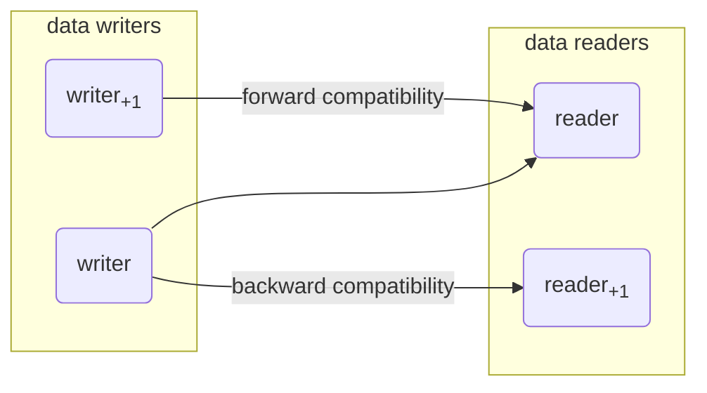

# Assessing compatibility based on schemata differences

_Backward compatibility_ - an ability of a system to understand input intended for previous versions of itself

_Forward compatibility_ - an ability of a system to understand input intended for future versions of itself

_Full compatibility_ - backward and forward compatibility combined

_No compatibility_ - neither level of compatibility

Maintaining backward and forward compatibility is important for minimizing disruption\
and ensuring smooth transitions when updating JSON schemas.

## Examples

- [assessing compatibility based on reduction of accepted types by a number](#assessing-compatibility-based-on-reduction-of-accepted-types-by-a-number)

- [assessing compatibility based on extension of accepted types by a number](#assessing-compatibility-based-on-extension-of-accepted-types-by-a-number)

- [assessing compatibility based on change of accepted type from integer to number](#assessing-compatibility-based-on-change-of-accepted-type-from-integer-to-number)

- [assessing compatibility based on TODO](#assessing-compatibility-based-on-todo)

- [assessing compatibility based on an accepted type change from null to boolean](#assessing-compatibility-based-on-an-accepted-type-change-from-null-to-boolean)

- [assessing compatibility based on change of accepted type from number to integer](#assessing-compatibility-based-on-change-of-accepted-type-from-number-to-integer)

- [assessing compatibility based on extending set of accepted value types from numbers to numbers and integers](#assessing-compatibility-based-on-extending-set-of-accepted-value-types-from-numbers-to-numbers-and-integers)

- [assessing compatibility based on no differences](#assessing-compatibility-based-on-no-differences)

- [assessing compatibility based on extension of accepted types by an additional type](#assessing-compatibility-based-on-extension-of-accepted-types-by-an-additional-type)

- [assessing compatibility based on old and new value of multipleOf being not each other's factors](#assessing-compatibility-based-on-old-and-new-value-of-multipleof-being-not-each-others-factors)

- [assessing compatibility based on reduction of accepted types](#assessing-compatibility-based-on-reduction-of-accepted-types)

- [assessing compatibility based on the range of allowed number values being extended](#assessing-compatibility-based-on-the-range-of-allowed-number-values-being-extended)

- [assessing compatibility based on the old value of multipleOf being divisible by the new one](#assessing-compatibility-based-on-the-old-value-of-multipleof-being-divisible-by-the-new-one)

- [assessing compatibility based on the new value of multipleOf being divisible by the old one](#assessing-compatibility-based-on-the-new-value-of-multipleof-being-divisible-by-the-old-one)

- [assessing compatibility based on the range gets unconstrained](#assessing-compatibility-based-on-the-range-gets-unconstrained)

- [assessing compatibility based on the range of allowed values being reduced](#assessing-compatibility-based-on-the-range-of-allowed-values-being-reduced)

- [assessing compatibility based on the range of allowed number values being extended and reduced at the same time](#assessing-compatibility-based-on-the-range-of-allowed-number-values-being-extended-and-reduced-at-the-same-time)

- [assessing compatibility based on the range of allowed number values being extended and reduced at the same time using exclusive versions of constraints](#assessing-compatibility-based-on-the-range-of-allowed-number-values-being-extended-and-reduced-at-the-same-time-using-exclusive-versions-of-constraints)

- [assessing compatibility based on the range of allowed values being reduced using the exclusive version of constraints](#assessing-compatibility-based-on-the-range-of-allowed-values-being-reduced-using-the-exclusive-version-of-constraints)

---

### assessing compatibility based on reduction of accepted types by a number

Because not every integer is a number, such a change is forward compatible.

_Input:_

reduction of accepted types by a number:

> - JSON schema path: #
>
>   change of accepted JSON value types from
>
>   - integer
>
>   - number
>
>   to
>
>   - integer

_Output:_

forward compatibility:

> Reasons for breaking the backward compatibility:
>
> - - schema path: #
>
>     the set of allowed JSON value types has been reduced by number

---

### assessing compatibility based on extension of accepted types by a number

Because not every integer is a number, such a change is backward compatible.

_Input:_

extension of accepted types by a number:

> - JSON schema path: #
>
>   change of accepted JSON value types from
>
>   - integer
>
>   to
>
>   - integer
>
>   - number

_Output:_

backward compatibility:

> Reasons for breaking the forward compatibility:
>
> - - schema path: #
>
>     the set of allowed JSON value types has been extended by number

---

### assessing compatibility based on change of accepted type from integer to number

Because every integer is a number, but not vice versa, such a change is backward compatible.

_Input:_

change of accepted type from integer to number:

> - JSON schema path: #
>
>   change of accepted JSON value types from
>
>   - integer
>
>   to
>
>   - number

_Output:_

backward compatibility:

> Reasons for breaking the forward compatibility:
>
> - - schema path: #
>
>     the set of allowed JSON value types has been extended by number

---

### assessing compatibility based on TODO

In this situation, all numbers from the new, longer range fall into the old, shorter range. Therefore, such a change is backward compatible.

_Input:_

TODO:

> - JSON schema path: #
>
>   change of exclusiveMaximum from 15.0 to 20.0
>
> - JSON schema path: #
>
>   change of exclusiveMinimum from 10.0 to 5.0

_Output:_

backward compatibility:

> Reasons for breaking the forward compatibility:
>
> - - schema path: #
>
>     the range of allowed values has been extended by (5.0,10.0] and [15.0,20.0)

---

### assessing compatibility based on an accepted type change from null to boolean

Because no boolean value can satisfy null JSON type constraint, and vice versa, such a change is incompatible.

_Input:_

an accepted type change from null to boolean:

> - JSON schema path: #
>
>   change of accepted JSON value types from
>
>   - null
>
>   to
>
>   - boolean

_Output:_

no compatibility:

> Reasons for breaking the forward compatibility:
>
> - - schema path: #
>
>     the set of allowed JSON value types has been extended by boolean
>
> Reasons for breaking the backward compatibility:
>
> - - schema path: #
>
>     the set of allowed JSON value types has been reduced by null

---

### assessing compatibility based on change of accepted type from number to integer

Because every integer is a number, but not vice versa, such a change is forward compatible.

_Input:_

change of accepted type from number to integer:

> - JSON schema path: #
>
>   change of accepted JSON value types from
>
>   - number
>
>   to
>
>   - integer

_Output:_

forward compatibility:

> Reasons for breaking the backward compatibility:
>
> - - schema path: #
>
>     the set of allowed JSON value types has been reduced by number

---

### assessing compatibility based on extending set of accepted value types from numbers to numbers and integers

every integer is also a number so this kind of difference does not have any implact

_Input:_

extending set of accepted value types from numbers to numbers and integers:

> - JSON schema path: #
>
>   change of accepted JSON value types from
>
>   - number
>
>   to
>
>   - integer
>
>   - number

_Output:_

full compatibility:

> ✓

---

### assessing compatibility based on no differences

identical schemata cannot be incompatible with each other

_Input:_

no differences:

> ∅

_Output:_

full compatibility:

> ✓

---

### assessing compatibility based on extension of accepted types by an additional type

Because more value types than before are accepted, this change is backward compatible.

_Input:_

extension of accepted types by an additional type:

> - JSON schema path: #
>
>   change of accepted JSON value types from
>
>   - null
>
>   to
>
>   - boolean
>
>   - null

_Output:_

backward compatibility:

> Reasons for breaking the forward compatibility:
>
> - - schema path: #
>
>     the set of allowed JSON value types has been extended by boolean

---

### assessing compatibility based on old and new value of multipleOf being not each other's factors

In this situation, there are potentially some numbers that are not divisible by neither of multipleOf values. Therefore, such a change is incompatible.

_Input:_

old and new value of multipleOf being not each other's factors:

> - JSON schema path: #
>
>   change of multipleOf from 2.0 to 

_Output:_

no compatibility:

> Reasons for breaking the forward compatibility:
>
> - - schema path: #
>
>     the new multiple constraint of 5.0 is not a factor of the olf multiple constraint of 2.0
>
> Reasons for breaking the backward compatibility:
>
> - - schema path: #
>
>     the old multiple constraint of 2.0 is not a factor of the new multiple constraint of 5.0

---

### assessing compatibility based on reduction of accepted types

Because less value types than before are accepted, this change is backward compatible.

_Input:_

reduction of accepted types:

> - JSON schema path: #
>
>   change of accepted JSON value types from
>
>   - boolean
>
>   - null
>
>   to
>
>   - null

_Output:_

forward compatibility:

> Reasons for breaking the backward compatibility:
>
> - - schema path: #
>
>     the set of allowed JSON value types has been reduced by boolean

---

### assessing compatibility based on the range of allowed number values being extended

In this situation, all numbers from the new, longer range fall into the old, shorter range. Therefore, such a change is backward compatible.

_Input:_

the range of allowed number values being extended:

> - JSON schema path: #
>
>   change of maximum from 15.0 to 20.0
>
> - JSON schema path: #
>
>   change of minimum from 10.0 to 5.0

_Output:_

backward compatibility:

> Reasons for breaking the forward compatibility:
>
> - - schema path: #
>
>     the range of allowed values has been extended by [5.0,10.0) and (15.0,20.0]

---

### assessing compatibility based on the old value of multipleOf being divisible by the new one

In this situation, all numbers from the new range fall into the old, unconstrained one. Therefore, such a change if forward compatible.

_Input:_

the old value of multipleOf being divisible by the new one:

> - JSON schema path: #
>
>   change of maximum from unspecified to 20.0
>
> - JSON schema path: #
>
>   change of minimum from unspecified to 5.0

_Output:_

forward compatibility:

> Reasons for breaking the backward compatibility:
>
> - - schema path: #
>
>     the range of allowed values has been reduced by (-Infinity,5.0) and (20.0,Infinity)

---

### assessing compatibility based on the new value of multipleOf being divisible by the old one

Because every multiple the new value is also a multiple of the old value, such a change is backward compatible

_Input:_

the new value of multipleOf being divisible by the old one:

> - JSON schema path: #
>
>   change of multipleOf from 2.0 to 

_Output:_

backward compatibility:

> Reasons for breaking the forward compatibility:
>
> - - schema path: #
>
>     the new multiple constraint of 4.0 is not a factor of the olf multiple constraint of 2.0

---

### assessing compatibility based on the range gets unconstrained

In this situation, all numbers from the old range fall into the new, unconstrained one. Therefore, such a change if forward backward compatible.

_Input:_

the range gets unconstrained:

> - JSON schema path: #
>
>   change of maximum from 20.0 to unspecified
>
> - JSON schema path: #
>
>   change of minimum from 5.0 to unspecified

_Output:_

backward compatibility:

> Reasons for breaking the forward compatibility:
>
> - - schema path: #
>
>     the range of allowed values has been extended by (-Infinity,5.0] and (20.0,Infinity)

---

### assessing compatibility based on the range of allowed values being reduced

In this situation, all numbers from the new, shorted range fall into the old, longer range. Therefore, such a change is forward compatible.

_Input:_

the range of allowed values being reduced:

> - JSON schema path: #
>
>   change of maximum from 20.0 to 15.0
>
> - JSON schema path: #
>
>   change of minimum from 5.0 to 10.0

_Output:_

forward compatibility:

> Reasons for breaking the backward compatibility:
>
> - - schema path: #
>
>     the range of allowed values has been reduced by [5.0,10.0) and (15.0,20.0]

---

### assessing compatibility based on the range of allowed number values being extended and reduced at the same time

In this situation, there are some numbers which do not fall into neither old nor new range. Therefore, such a change is incompatible.

_Input:_

the range of allowed number values being extended and reduced at the same time:

> - JSON schema path: #
>
>   change of maximum from 15.0 to 20.0
>
> - JSON schema path: #
>
>   change of minimum from 5.0 to 10.0

_Output:_

no compatibility:

> Reasons for breaking the forward compatibility:
>
> - - schema path: #
>
>     the range of allowed values has been extended by (15.0,20.0]
>
> Reasons for breaking the backward compatibility:
>
> - - schema path: #
>
>     the range of allowed values has been reduced by [5.0,10.0)

---

### assessing compatibility based on the range of allowed number values being extended and reduced at the same time using exclusive versions of constraints

In this situation, there are some numbers which do not fall into neither old nor new range. Therefore, such a change is incompatible.

_Input:_

the range of allowed number values being extended and reduced at the same time using exclusive versions of constraints:

> - JSON schema path: #
>
>   change of exclusiveMaximum from 15.0 to 20.0
>
> - JSON schema path: #
>
>   change of exclusiveMinimum from 5.0 to 10.0

_Output:_

no compatibility:

> Reasons for breaking the forward compatibility:
>
> - - schema path: #
>
>     the range of allowed values has been extended by [15.0,20.0)
>
> Reasons for breaking the backward compatibility:
>
> - - schema path: #
>
>     the range of allowed values has been reduced by (5.0,10.0]

---

### assessing compatibility based on the range of allowed values being reduced using the exclusive version of constraints

In this situation, all numbers from the new, shorted range fall into the old, longer range. Therefore, such a change is forward compatible.

_Input:_

the range of allowed values being reduced using the exclusive version of constraints:

> - JSON schema path: #
>
>   change of exclusiveMaximum from 20.0 to 15.0
>
> - JSON schema path: #
>
>   change of exclusiveMinimum from 5.0 to 10.0

_Output:_

forward compatibility:

> Reasons for breaking the backward compatibility:
>
> - - schema path: #
>
>     the range of allowed values has been reduced by (5.0,10.0] and [15.0,20.0)
