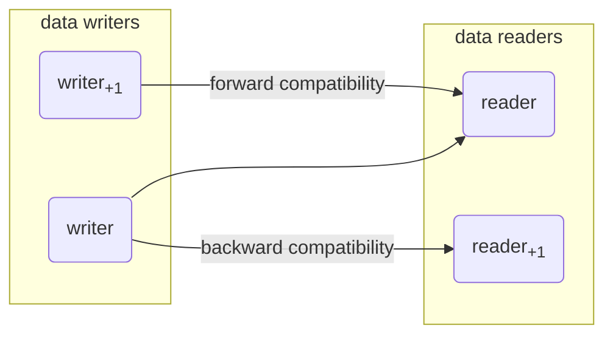

# JSON Schema Change Compatibility Checks

**Backward compatibility** - an ability of a system to understand input intended for previous versions of itself

**Forward compatibility** - an ability of a system to understand input intended for future versions of itself

**Full compatibility** - backward and forward compatibility combined

**No compatibility** - neither level of compatibility

Maintaining backward and forward compatibility is important for minimizing disruption

and ensuring smooth transitions when updating JSON schemas.




## Examples of calculating compatibility based on

- [expected JSON value type changing from integer to number](#expected-json-value-type-changing-from-integer-to-number)
- [expected JSON value type changing from null to boolean](#expected-json-value-type-changing-from-null-to-boolean)
- [expected JSON value type changing from number to integer](#expected-json-value-type-changing-from-number-to-integer)
- [expected JSON value types being extended from just null to null and boolean](#expected-json-value-types-being-extended-from-just-null-to-null-and-boolean)
- [expected JSON value types being reduced from null and boolean to just null](#expected-json-value-types-being-reduced-from-null-and-boolean-to-just-null)
- [expected JSON value types including integer and number being reduced by integer](#expected-json-value-types-including-integer-and-number-being-reduced-by-integer)
- [expected JSON value types including integer and number being reuced by number](#expected-json-value-types-including-integer-and-number-being-reuced-by-number)
- [expected JSON value types including integer being extended by number](#expected-json-value-types-including-integer-being-extended-by-number)
- [expected JSON value types including number being extended by integer](#expected-json-value-types-including-number-being-extended-by-integer)
- [no differences](#no-differences)
- [old and new value of multipleOf being not each other's factors](#old-and-new-value-of-multipleof-being-not-each-others-factors)
- [the new value of multipleOf being divisible by the old one](#the-new-value-of-multipleof-being-divisible-by-the-old-one)
- [the old value of multipleOf being divisible by the new one](#the-old-value-of-multipleof-being-divisible-by-the-new-one)
- [the range gets constrained](#the-range-gets-constrained)
- [the range gets unconstrained](#the-range-gets-unconstrained)
- [the range of allowed number values being extended](#the-range-of-allowed-number-values-being-extended)
- [the range of allowed number values being extended and reduced at the same time](#the-range-of-allowed-number-values-being-extended-and-reduced-at-the-same-time)
- [the range of allowed number values being extended and reduced at the same time using exclusive versions of constraints](#the-range-of-allowed-number-values-being-extended-and-reduced-at-the-same-time-using-exclusive-versions-of-constraints)
- [the range of allowed number values being extended using exclusive versions of constraints](#the-range-of-allowed-number-values-being-extended-using-exclusive-versions-of-constraints)
- [the range of allowed number values being reduced](#the-range-of-allowed-number-values-being-reduced)
- [the range of allowed number values being reduced using exclusive versions of constraints](#the-range-of-allowed-number-values-being-reduced-using-exclusive-versions-of-constraints)
---

### expected JSON value type changing from integer to number

Because every integer is a number, but not vice versa, such a change is backward compatible.

**Input:**

*JSON schema differences:*

```text
-
  Schema path: #
  change of accepted JSON value types from 
  - integer
  to
  - number
```
**Output:**

```text
backward compatible:
- at #
  the set of allowed JSON value types has been extended by number
```
---

### expected JSON value type changing from number to integer

Because every integer is a number, but not vice versa, such a change is forward compatible.

**Input:**

*JSON schema differences:*

```text
-
  Schema path: #
  change of accepted JSON value types from 
  - number
  to
  - integer
```
**Output:**

```text
forward compatible:
- at #
  the set of allowed JSON value types has been reduced by number
```
---

### expected JSON value types including integer and number being reduced by integer

Because every integer is a number, such a change is fully compatible.

**Input:**

*JSON schema differences:*

```text
-
  Schema path: #
  change of accepted JSON value types from 
  - integer
  - number
  to
  - number
```
**Output:**

```text
fully compatible
```
---

### expected JSON value types including number being extended by integer

Because every integer is a number, such a change is fully compatible.

**Input:**

*JSON schema differences:*

```text
-
  Schema path: #
  change of accepted JSON value types from 
  - number
  to
  - integer
  - number
```
**Output:**

```text
fully compatible
```
---

### the new value of multipleOf being divisible by the old one

Because every multiple the new value is also a multiple of the old value, such a change is backward compatible

**Input:**

*JSON schema differences:*

```text
-
  Schema path: #
  change of multipleOf from 2.0 to 4.0
```
**Output:**

```text
backward compatible:
- at #
  the new multiple constraint of 4.0 is not a factor of the olf multiple constraint of 2.0
```
---

### the old value of multipleOf being divisible by the new one

Because every multiple the old value is also a multiple of the new value, such a change is forward compatible

**Input:**

*JSON schema differences:*

```text
-
  Schema path: #
  change of multipleOf from 4.0 to 2.0
```
**Output:**

```text
forward compatible:
- at #
  the old multiple constraint of 4.0 is not a factor of the new multiple constraint of 2.0
```
---

### expected JSON value types being reduced from null and boolean to just null

Because less value types than before are accepted, this change is forward compatible.

**Input:**

*JSON schema differences:*

```text
-
  Schema path: #
  change of accepted JSON value types from 
  - boolean
  - null
  to
  - null
```
**Output:**

```text
forward compatible:
- at #
  the set of allowed JSON value types has been reduced by boolean
```
---

### expected JSON value types being extended from just null to null and boolean

Because more value types than before are accepted, this change is backward compatible.

**Input:**

*JSON schema differences:*

```text
-
  Schema path: #
  change of accepted JSON value types from 
  - null
  to
  - boolean
  - null
```
**Output:**

```text
backward compatible:
- at #
  the set of allowed JSON value types has been extended by boolean
```
---

### expected JSON value type changing from null to boolean

Because no boolean value can satisfy null JSON type constraint, and vice versa, such a change is incompatible.

**Input:**

*JSON schema differences:*

```text
-
  Schema path: #
  change of accepted JSON value types from 
  - null
  to
  - boolean
```
**Output:**

```text
incompatible:
- at #
  the set of allowed JSON value types has been extended by boolean- at #
  the set of allowed JSON value types has been reduced by null
```
---

### expected JSON value types including integer being extended by number

Because not every integer is a number, such a change is backward compatible.

**Input:**

*JSON schema differences:*

```text
-
  Schema path: #
  change of accepted JSON value types from 
  - integer
  to
  - integer
  - number
```
**Output:**

```text
backward compatible:
- at #
  the set of allowed JSON value types has been extended by number
```
---

### expected JSON value types including integer and number being reuced by number

Because not every integer is a number, such a change is forward compatible.

**Input:**

*JSON schema differences:*

```text
-
  Schema path: #
  change of accepted JSON value types from 
  - integer
  - number
  to
  - integer
```
**Output:**

```text
forward compatible:
- at #
  the set of allowed JSON value types has been reduced by number
```
---

### the range gets constrained

In this situation, all numbers from the new range fall into the old, unconstrained one. Therefore, such a change if forward compatible.

**Input:**

*JSON schema differences:*

```text
-
  Schema path: #
  change of maximum from unspecified to 20.0
-
  Schema path: #
  change of minimum from unspecified to 5.0
```
**Output:**

```text
forward compatible:
- at #
  the range of allowed values has been reduced by (-Infinity,5.0) and (20.0,Infinity)
```
---

### the range of allowed number values being extended using exclusive versions of constraints

In this situation, all numbers from the new, longer range fall into the old, shorter range. Therefore, such a change is backward compatible.

**Input:**

*JSON schema differences:*

```text
-
  Schema path: #
  change of exclusiveMaximum from 15.0 to 20.0
-
  Schema path: #
  change of exclusiveMinimum from 10.0 to 5.0
```
**Output:**

```text
backward compatible:
- at #
  the range of allowed values has been extended by (5.0,10.0] and [15.0,20.0)
```
---

### the range of allowed number values being extended

In this situation, all numbers from the new, longer range fall into the old, shorter range. Therefore, such a change is backward compatible.

**Input:**

*JSON schema differences:*

```text
-
  Schema path: #
  change of maximum from 15.0 to 20.0
-
  Schema path: #
  change of minimum from 10.0 to 5.0
```
**Output:**

```text
backward compatible:
- at #
  the range of allowed values has been extended by [5.0,10.0) and (15.0,20.0]
```
---

### the range of allowed number values being reduced using exclusive versions of constraints

In this situation, all numbers from the new, shorted range fall into the old, longer range. Therefore, such a change is forward compatible.

**Input:**

*JSON schema differences:*

```text
-
  Schema path: #
  change of exclusiveMaximum from 20.0 to 15.0
-
  Schema path: #
  change of exclusiveMinimum from 5.0 to 10.0
```
**Output:**

```text
forward compatible:
- at #
  the range of allowed values has been reduced by (5.0,10.0] and [15.0,20.0)
```
---

### the range of allowed number values being reduced

In this situation, all numbers from the new, shorted range fall into the old, longer range. Therefore, such a change is forward compatible.

**Input:**

*JSON schema differences:*

```text
-
  Schema path: #
  change of maximum from 20.0 to 15.0
-
  Schema path: #
  change of minimum from 5.0 to 10.0
```
**Output:**

```text
forward compatible:
- at #
  the range of allowed values has been reduced by [5.0,10.0) and (15.0,20.0]
```
---

### the range gets unconstrained

In this situation, all numbers from the old range fall into the new, unconstrained one. Therefore, such a change if forward backward compatible.

**Input:**

*JSON schema differences:*

```text
-
  Schema path: #
  change of maximum from 20.0 to unspecified
-
  Schema path: #
  change of minimum from 5.0 to unspecified
```
**Output:**

```text
backward compatible:
- at #
  the range of allowed values has been extended by (-Infinity,5.0] and (20.0,Infinity)
```
---

### old and new value of multipleOf being not each other's factors

In this situation, there are potentially some numbers that are not divisible by neither of multipleOf values. Therefore, such a change is incompatible.

**Input:**

*JSON schema differences:*

```text
-
  Schema path: #
  change of multipleOf from 2.0 to 5.0
```
**Output:**

```text
incompatible:
- at #
  the new multiple constraint of 5.0 is not a factor of the olf multiple constraint of 2.0- at #
  the old multiple constraint of 2.0 is not a factor of the new multiple constraint of 5.0
```
---

### the range of allowed number values being extended and reduced at the same time using exclusive versions of constraints

In this situation, there are some numbers which do not fall into neither old nor new range. Therefore, such a change is incompatible.

**Input:**

*JSON schema differences:*

```text
-
  Schema path: #
  change of exclusiveMaximum from 15.0 to 20.0
-
  Schema path: #
  change of exclusiveMinimum from 5.0 to 10.0
```
**Output:**

```text
incompatible:
- at #
  the range of allowed values has been extended by [15.0,20.0)- at #
  the range of allowed values has been reduced by (5.0,10.0]
```
---

### the range of allowed number values being extended and reduced at the same time

In this situation, there are some numbers which do not fall into neither old nor new range. Therefore, such a change is incompatible.

**Input:**

*JSON schema differences:*

```text
-
  Schema path: #
  change of maximum from 15.0 to 20.0
-
  Schema path: #
  change of minimum from 5.0 to 10.0
```
**Output:**

```text
incompatible:
- at #
  the range of allowed values has been extended by (15.0,20.0]- at #
  the range of allowed values has been reduced by [5.0,10.0)
```
---

### no differences

When there is no JSON schema differences, schema change is fully compatible.

**Input:**

*JSON schema differences:*

```text
no differences
```
**Output:**

```text
fully compatible
```
