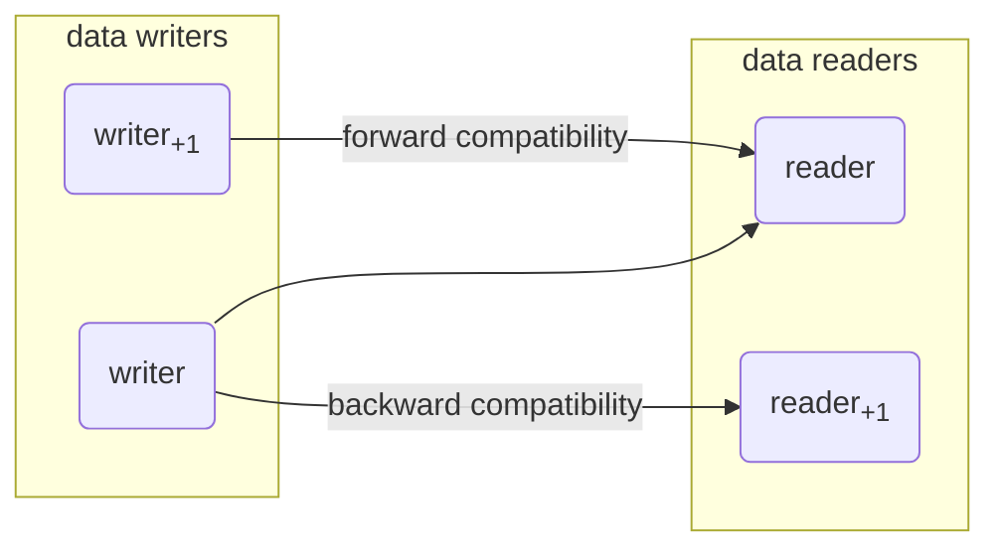

---
## JSON Schema Change Compatibility Checks
**Backward compatibility** - an ability of a system to understand input intended for previous versions of itself

**Forward compatibility** - an ability of a system to understand input intended for future versions of itself

**Full compatibility** - backward and forward compatibility combined

**No compatibility** - neither level of compatibility




Examples:

- [No JSON schema differences](#no-json-schema-differences)
- [Expected JSON value type changes from null to boolean](#expected-json-value-type-changes-from-null-to-boolean)
- [Expected JSON value type changes from integer to number](#expected-json-value-type-changes-from-integer-to-number)
- [Expected JSON value type changes from number to integer](#expected-json-value-type-changes-from-number-to-integer)
- [Expected JSON value types is extended](#expected-json-value-types-is-extended)
- [Expected JSON value types is reduced](#expected-json-value-types-is-reduced)
- [Expected JSON value types including number is extended by integer](#expected-json-value-types-including-number-is-extended-by-integer)
- [Expected JSON value types including integer is extended by number](#expected-json-value-types-including-integer-is-extended-by-number)
- [Expected JSON value types including integer and number is reduced by integer](#expected-json-value-types-including-integer-and-number-is-reduced-by-integer)
- [Expected JSON value types including integer and number is reuced by number](#expected-json-value-types-including-integer-and-number-is-reuced-by-number)
### No JSON schema differences
When there is not JSON schema differences, schema change is fully compatible.

#### Input
##### JSON schema differences
```
no differences
```
#### Output
```
full
```
### Expected JSON value type changes from null to boolean
Because no boolean value can satisfy null JSON type constraint, and vice versa, such a change is incompatible.

#### Input
##### JSON schema differences
```
-
  Schema path: #
  Change of accepted JSON value types from 
  - null
  to
  - boolean
```
#### Output
```
none
```
### Expected JSON value type changes from integer to number
Because every integer is a number, but not vice versa, such a change is backward compatible.

#### Input
##### JSON schema differences
```
-
  Schema path: #
  Change of accepted JSON value types from 
  - integer
  to
  - number
```
#### Output
```
backward
```
### Expected JSON value type changes from number to integer
Because every integer is a number, but not vice versa, such a change is forward compatible.

#### Input
##### JSON schema differences
```
-
  Schema path: #
  Change of accepted JSON value types from 
  - number
  to
  - integer
```
#### Output
```
forward
```
### Expected JSON value types is extended
Because more value types than before are accepted, this change is backward compatible.

#### Input
##### JSON schema differences
```
-
  Schema path: #
  Change of accepted JSON value types from 
  - null
  to
  - boolean
  - null
```
#### Output
```
backward
```
### Expected JSON value types is reduced
Because less value types than before are accepted, this change is forward compatible.

#### Input
##### JSON schema differences
```
-
  Schema path: #
  Change of accepted JSON value types from 
  - boolean
  - null
  to
  - null
```
#### Output
```
forward
```
### Expected JSON value types including number is extended by integer
Because every integer is a number, such a change is fully compatible.

#### Input
##### JSON schema differences
```
-
  Schema path: #
  Change of accepted JSON value types from 
  - number
  to
  - integer
  - number
```
#### Output
```
full
```
### Expected JSON value types including integer is extended by number
Because not every integer is a number, such a change is backward compatible.

#### Input
##### JSON schema differences
```
-
  Schema path: #
  Change of accepted JSON value types from 
  - integer
  to
  - integer
  - number
```
#### Output
```
backward
```
### Expected JSON value types including integer and number is reduced by integer
Because every integer is a number, such a change is fully compatible.

#### Input
##### JSON schema differences
```
-
  Schema path: #
  Change of accepted JSON value types from 
  - integer
  - number
  to
  - number
```
#### Output
```
full
```
### Expected JSON value types including integer and number is reuced by number
Because not every integer is a number, such a change is forward compatible.

#### Input
##### JSON schema differences
```
-
  Schema path: #
  Change of accepted JSON value types from 
  - integer
  - number
  to
  - integer
```
#### Output
```
forward
```
