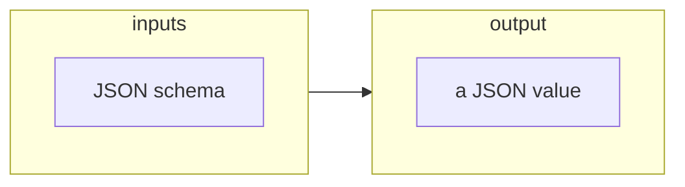

# Printing a JSON value representing a JSON schema

## Schema

```mermaid
flowchart LR
    subgraph inputs
        input_desc_0["JSON schema"]
    end
    subgraph output
        output_desc["a JSON value"]
    end
    inputs --> output
```

## Context

## Properties

- always prints a well-formatted schema JSON
