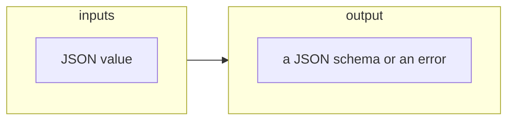

# Producing a JSON schema or an error as a result of parsing JSON value

## Schema



## Context

JSON schema is commonly expressed in a JSON format. However, not every JSON is a valid JSON schema.

## Examples

- [producing a JSON schema or an error as a result of parsing a boolean JSON value](#producing-a-json-schema-or-an-error-as-a-result-of-parsing-a-boolean-json-value)

- [producing a JSON schema or an error as a result of parsing A JSON object with 'type' property set to an array with a single 'null' string inside it](#producing-a-json-schema-or-an-error-as-a-result-of-parsing-a-json-object-with-type-property-set-to-an-array-with-a-single-null-string-inside-it)

- [producing a JSON schema or an error as a result of parsing A JSON object with 'type' property defined](#producing-a-json-schema-or-an-error-as-a-result-of-parsing-a-json-object-with-type-property-defined)

- [producing a JSON schema or an error as a result of parsing A JSON object with 'required' property being array of strings](#producing-a-json-schema-or-an-error-as-a-result-of-parsing-a-json-object-with-required-property-being-array-of-strings)

- [producing a JSON schema or an error as a result of parsing A JSON object with 'type' property set to an array with 'array', 'null' and 'string' strings inside it](#producing-a-json-schema-or-an-error-as-a-result-of-parsing-a-json-object-with-type-property-set-to-an-array-with-array-null-and-string-strings-inside-it)

- [producing a JSON schema or an error as a result of parsing A JSON object with 'uniqueItems' property set](#producing-a-json-schema-or-an-error-as-a-result-of-parsing-a-json-object-with-uniqueitems-property-set)

- [producing a JSON schema or an error as a result of parsing A JSON object with 'type' property set to an empty array](#producing-a-json-schema-or-an-error-as-a-result-of-parsing-a-json-object-with-type-property-set-to-an-empty-array)

- [producing a JSON schema or an error as a result of parsing a JSON value not being a boolean or object](#producing-a-json-schema-or-an-error-as-a-result-of-parsing-a-json-value-not-being-a-boolean-or-object)

- [producing a JSON schema or an error as a result of parsing an JSON object with the 'not' property defined](#producing-a-json-schema-or-an-error-as-a-result-of-parsing-an-json-object-with-the-not-property-defined)

- [producing a JSON schema or an error as a result of parsing an JSON object with the 'items' property defined](#producing-a-json-schema-or-an-error-as-a-result-of-parsing-an-json-object-with-the-items-property-defined)

- [producing a JSON schema or an error as a result of parsing an empty JSON object](#producing-a-json-schema-or-an-error-as-a-result-of-parsing-an-empty-json-object)

---

### producing a JSON schema or an error as a result of parsing a boolean JSON value

Because a boolean value of false is a valid schema which passes
validation of any JSON value, such a value represents a JSON schema.

_Input:_

a boolean JSON value:

> ```json
> false
> ```

_Output:_

a successfully parsed JSON schema:

> ```json
> false
> ```

---

### producing a JSON schema or an error as a result of parsing A JSON object with 'type' property set to an array with a single 'null' string inside it

Because the 'type' keyword defines acceptable JSON types. It can be in a
form of an array of string (here, only with one type defined), such a
value represents a JSON schema.

_Input:_

A JSON object with 'type' property set to an array with a single 'null'
string inside it:

> ```json
> {
>   "type": [
>     "null"
>   ]
> }
> ```

_Output:_

a successfully parsed JSON schema:

> ```json
> {
>   "type": [
>     "null"
>   ]
> }
> ```

---

### producing a JSON schema or an error as a result of parsing A JSON object with 'type' property defined

Because the 'type' keyword defines acceptable JSON types. It can be in a
form of a single string, such a value represents a JSON schema.

_Input:_

A JSON object with 'type' property defined:

> ```json
> {
>   "type": "null"
> }
> ```

_Output:_

a successfully parsed JSON schema:

> ```json
> {
>   "type": [
>     "null"
>   ]
> }
> ```

---

### producing a JSON schema or an error as a result of parsing A JSON object with 'required' property being array of strings

Because the 'required' constrain rejects any JSON object not containing
properties defined by it, such a value represents a JSON schema.

_Input:_

A JSON object with 'required' property being array of strings:

> ```json
> {
>   "required": [
>     "prop1",
>     "prop2"
>   ]
> }
> ```

_Output:_

a successfully parsed JSON schema:

> ```json
> {
>   "required": [
>     "prop1",
>     "prop2"
>   ]
> }
> ```

---

### producing a JSON schema or an error as a result of parsing A JSON object with 'type' property set to an array with 'array', 'null' and 'string' strings inside it

Because the 'type' keyword defines acceptable JSON types. It can be in a
form of an array of string (here, with three types defined), such a
value represents a JSON schema.

_Input:_

A JSON object with 'type' property set to an array with 'array', 'null'
and 'string' strings inside it:

> ```json
> {
>   "type": [
>     "array",
>     "null",
>     "string"
>   ]
> }
> ```

_Output:_

a successfully parsed JSON schema:

> ```json
> {
>   "type": [
>     "array",
>     "null",
>     "string"
>   ]
> }
> ```

---

### producing a JSON schema or an error as a result of parsing A JSON object with 'uniqueItems' property set

Because the 'uniqueItems' keyword makes sure that if JSON value is an
array, its items do not contain any duplicates, such a value represents
a JSON schema.

_Input:_

A JSON object with 'uniqueItems' property set:

> ```json
> {
>   "uniqueItems": true
> }
> ```

_Output:_

a successfully parsed JSON schema:

> ```json
> {
>   "uniqueItems": true
> }
> ```

---

### producing a JSON schema or an error as a result of parsing A JSON object with 'type' property set to an empty array

Because the 'type' keyword defines acceptable JSON types. It can be in a
form of an array of string (here, with no types defined), such a value
represents a JSON schema.

_Input:_

A JSON object with 'type' property set to an empty array:

> ```json
> {
>   "type": []
> }
> ```

_Output:_

a successfully parsed JSON schema:

> ```json
> {
>   "type": []
> }
> ```

---

### producing a JSON schema or an error as a result of parsing a JSON value not being a boolean or object

Because booleans and objects are the only acceptable forms, such a value
does not represent a JSON schema.

_Input:_

a JSON value not being a boolean or object:

> ```json
> 0
> ```

_Output:_

a parsing error:

> an error:
>
> `"the JSON value is neither a boolean nor an object"`

---

### producing a JSON schema or an error as a result of parsing an JSON object with the 'not' property defined

Because the 'not' constrain rejects any JSON value which conform to
schema defined by it, such a value represents a JSON schema.

_Input:_

an JSON object with the 'not' property defined:

> ```json
> {
>   "not": true
> }
> ```

_Output:_

a successfully parsed JSON schema:

> ```json
> {
>   "not": true
> }
> ```

---

### producing a JSON schema or an error as a result of parsing an JSON object with the 'items' property defined

Because the 'items' constrain makes sure than if a JSON value is an
array, every item of that array conforms the schema defined by it, such
a value represents a JSON schema.

_Input:_

an JSON object with the 'items' property defined:

> ```json
> {
>   "items": true
> }
> ```

_Output:_

a successfully parsed JSON schema:

> ```json
> {
>   "items": true
> }
> ```

---

### producing a JSON schema or an error as a result of parsing an empty JSON object

Because an empty JSON object is a valid schema which passes validation
of any JSON value, such a value represents a JSON schema.

_Input:_

an empty JSON object:

> ```json
> {}
> ```

_Output:_

a successfully parsed JSON schema:

> ```json
> {}
> ```
