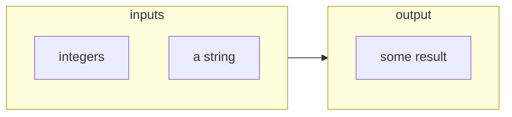

# Computation of some result based on integers and a string

## Schema

## Context

computation context

## Properties

- property1 description

- property2 description

## Examples

- [computation of some result based on number one and two and a three letter word](#computation-of-some-result-based-on-number-one-and-two-and-a-three-letter-word)

- [computation of some result based on number two, three and four and a three letter word](#computation-of-some-result-based-on-number-two-three-and-four-and-a-three-letter-word)

---

### computation of some result based on number one and two and a three letter word

example1 description

_Input:_

number one and two:

> 1. `1`
>
> 1. `2`

a three letter word:

> `"fox"`

_Output:_

false value:

> `false`

---

### computation of some result based on number two, three and four and a three letter word

example2 description

_Input:_

number two, three and four:

> 1. `2`
>
> 1. `3`
>
> 1. `4`

a three letter word:

> `"fox"`

_Output:_

true value:

> `true`
