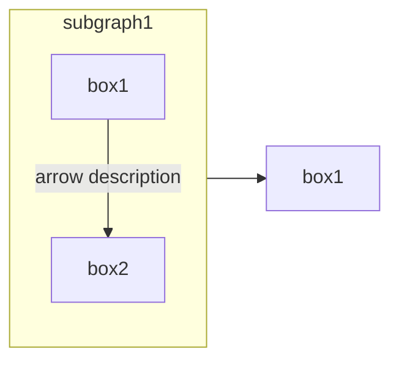

```mermaid
flowchart LR
    subgraph subgraph1
        subgraph1_box1["box1"]
        subgraph1_box2["box2"]
    end
    box1["box1"]
    subgraph1 --> box1
    subgraph1_box1 -->|arrow description| subgraph1_box2
```
